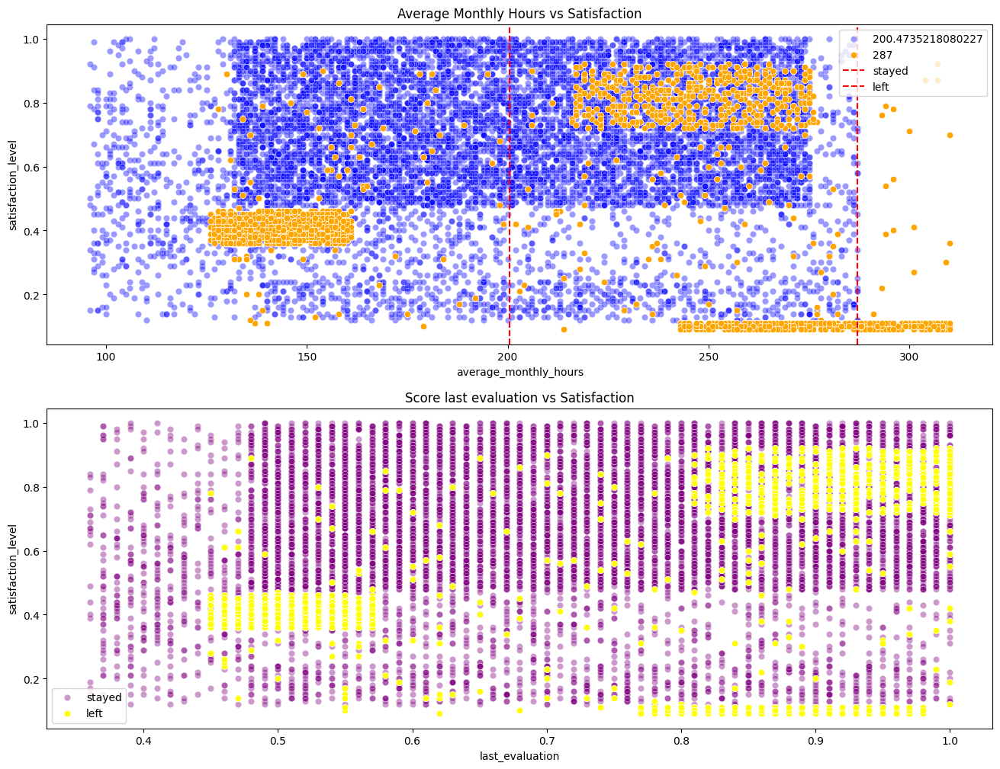
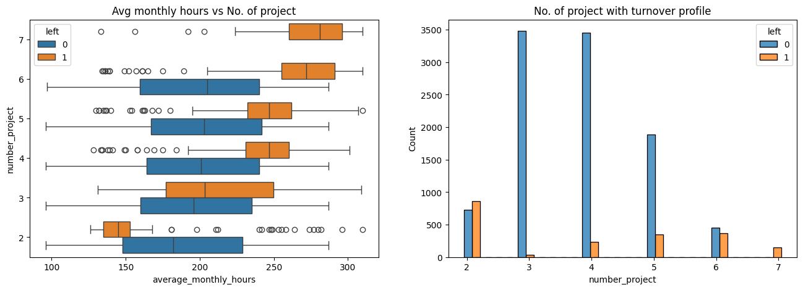
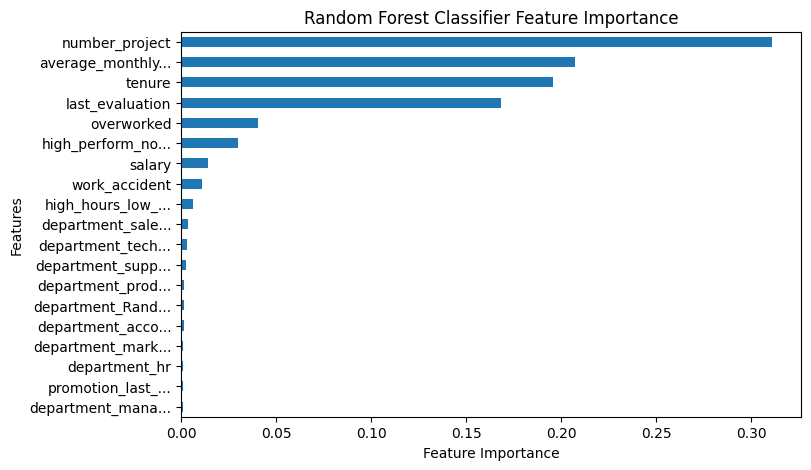

## Salifort Motors Employee Turnover Prediction Model

### Overview
This project aims to predict whether or not an employee will leave the company and determine the features that greatly affects this behavior. A logistic regression, random forest, and xgboost classifier was created and the results were compared in order to get the best model. This project utilized fictional company `Salifort Motors` HR data. The final random forest model performed with ROC-AUC score of 0.97 with precision of 0.95 and recall of 0.90. The number of projects and average monthly hours an employee work are the most influential in determining if an employee will leave the company or not.

[salifort-motors-employee-turnover](salifort-motors-employee-turnover.ipynb) is the main notebook that contains the analysis project.  
[Executive summary](exec-summary.pdf) contains the executive summary of this project.

## Business Understanding
The cost for a company of replacing an employee leaving ranges from 30% - 400% of an employee's annual salary which increases based on the role level. The company needs to spend on recruitment, onboarding, and training. Company also lost productivity as new hires require a ramp up period in order to be fully autonomous for the team. There is also the knowledge loss for the employee's experience and team burnout where the remaining personnel are required to pickup extra workload loss when an employee leave. Predicting and making initiatives to lessen employee turnover is beneficial in terms of cost and morale for the company and its employees. 

## Data Understanding
The Salifort Motors data consists of 14999 rows with 10 features. The features include satisfaction level, number of projects of employees, average monthly hours, evaluation score, and other employee statistics. 

## Analysis
The scatter plot of average monthly hours with satisfaction level revealed three clusters of employee who left the company. When further studied, common characteristics were observed in each cluster. 

The groups characteristics:
- Low performing employees with evaluation scores of only 0.48-0.54, only have 2 projects and 3 years in the company.
- Employees who are 5 years in the company, work 237-262 hours/month, 4-5 projects,high evaluation scores 0.87-0.98, and fair satisfaction 0.77-0.87
- Dissatisfied high performing employees with 0.82-0.93 evaluation scores but overworked with 256-285 hours monthly, 6-7 projects, on their 4th year in the company

Only 13% of those who left do not belong to these groups.

Another notable observation is the plot of average monthly hours with number of projects. 

The graph showed that employees who worked greater hours compared to their peers with the same number of project are more likely to leave. This was later confirmed with hypothesis testing. The plot of number of projects revealed that the optimum number of projects is 3-5 where employee turnover ratio are the least.

## Modelling and Evaluation 
Random Forest Classifier comprising of 400 decision trees produce the greatest result. The evaluation scores are ROC-AUC=0.97, precision=0.95, recall=0.90 which means that the model is great at predicing the positive cases (employee leaving). 

## Conclusion
The model can help the company predict whether or not the employee will leave. The most important features that affect the employee decision are number of projects and average monthly hours.

